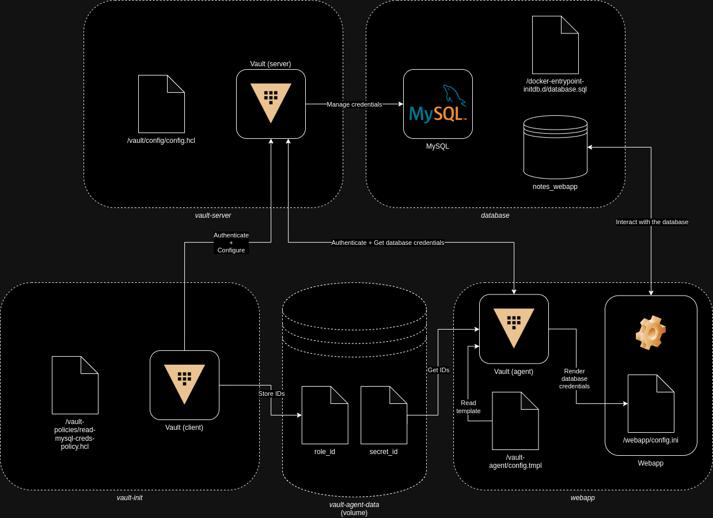

# vault-webapp-integration-poc

A PoC for the integration of HashiCorp Vault with a webapp.

## Setup

1. Launch `sudo ./up.sh`.
2. Connect to: [http://localhost:1337/](http://localhost:1337/).

## Teardown

1. Launch `sudo ./down.sh`.

## About

I decided to develop this toy project to learn about [*HashiCorp Vault*](https://www.vaultproject.io/), in particular to focus on its integration with web applications. I was not able to find a complete enough example on the Internet to answer all of my doubts, so I decided to build it myself.

## Technical description

The project simulates a web application with a database integrated with HashiCorp Vault for the secure management of database credentials.

The project is composed by different containerized components:
* `vault-server` is the Vault installation in server mode dedicated to the secrets management.
* `vault-init` is an utility container used to automate part of the configuration and integration with the `vault-server`.
* `database` is the MySQL database used by the web application.
* `webapp` is the Flask web application that uses the MySQL database to store and read data.

### Architecture

### How does it work?

Here the list of things that happen when the infrastructure is created.

1. The `vault-server` container starts instantiating Vault in server mode. The Vault server is configured via the `config.hcl` configuration file that is copied under the `/vault/config/` directory.
1. The `database` container starts:
   1. A root account for MySQL is created with the specified password.
   1. A MySQL database called `notes_webapp` is created.
   1. The entire structure of the `notes_webapp` database is created via the `database.sql` script that is copied under the `/docker-entrypoint-initdb.d/` directory.
1. The `vault-init` container starts to perform most of the configuration:
   1. The container mounts a volume, `vault-agent-data`, that will be used to store the IDs for the Vault agent and share with it.
   1. The Vault server is initialized.
   1. The Vault server is unsealed.
   1. Login on the Vault server is performed for the next operations.
   1. The container waits the MySQL database to be up and running.
   1. The secrets engine for database is enabled on the Vault server.
   1. A configuration for the MySQL database called `mysql-database` is created on the Vault server specifying root credentials.
   1. A restrictive database role called `mysql-role` to create new users on the MySQL database is configured on the Vault server. New users will be only able to `SELECT` and `INSERT` on tables of the `notes_webapp` database.
   1. Root credentials of MySQL are rotated by the Vault server. **Note:** this seems to do not work properly!
   1. A new policy called `read-mysql-creds-policy` is created on the Vault server using the `read-mysql-creds-policy.hcl` file. This policy allows to read only credentials for users of the MySQL database.
   1. The AppRole auth method is enabled on the Vault server.
   1. An AppRole called `webapp-role` for the web application is created on the Vault server. The AppRole is configured with the policy defined before.
   1. `role_id` and `secret_id` for the created AppRole are stored in the volume `vault-agent-data`.
   1. The container loops to recreate `secret_id` to prevent lockout of the webapp after the secret expiration (please consider that this is a very simplistic approach).
1. The `webapp` container starts:
   1. The `vault-agent-data` volume is mounted.
   1. Several prerequisites are installed. The Vault agent is installed.
   1. The configuration files are copied in the container.
   1. The source code of the Flask application is copied in the container.
   1. The Vault agent is run with the configuration specified in the `vault-agent.hcl` file.
   1. The Flask web application is run.

The Vault agent is configured in `auto_auth` mode and it will use the `role_id` and the `secret_id` to obtain token and store it in the defined sink (`/vault-agent/vault-token-via-agent`). The Vault agent reads the format of the configuration file, needed by the application, that is defined in the `/vault-agent/config.tmpl` file and it produces, as an output, a destination file (`/webapp/config.ini`) that can be consumed by the web application itself.

From the web application is possible to dump the content of the configuration files. This allows to check what database and Vault credentials are used.

## Considerations and caveats

If you find something that is *completely wrong*, please feel free to let me know via a PR. I started this project to learn, so I appreciate some help!

I tried to apply as many "production ready" configurations as possible, however there are some configurations that I didn't apply for the sake of simplicity, e.g., the TLS with the Vault server, or design decisions that are totally arbitrary, e.g., the whole `vault-init` logic to initialize everything and - more important - the one to keep `secret_id` updated.

For these reasons, **I'm not responsible if you use my project as a starting point and bad things happen!**

The webapp I developed is simple stupid. I just needed something able read/write from/to database and to get configurations from files. There are no fancy techniques and it's pretty basic. Again, my main purpose was to play with Vault and understand its capabilities, limitations and challenges, especially in the integration process.

Furthermore, in the webapp I also log around tons of secrets, but that's intended for learning and troubleshooting purposes. Don't do that in real systems, please! :)

## References and resources

Here the list of references and resources used during the implementation:
* [GitHub - ahmetkaftan/docker-vault](https://github.com/ahmetkaftan/docker-vault)
* [HashiCorp Vault - Developer - MySQL/MariaDB database secrets engine - Setup](https://developer.hashicorp.com/vault/docs/secrets/databases/mysql-maria#setup)
* [HashiCorp Vault - Developer - Database root credential rotation](https://developer.hashicorp.com/vault/tutorials/db-credentials/database-root-rotation#step-3-rotate-the-root-credentials)
* [HashiCorp Vault - Developer - Policies - Associate Policies to Auth Methods](https://developer.hashicorp.com/vault/tutorials/getting-started/getting-started-policies#associate-policies-to-auth-methods)
* [HashiCorp Vault - Developer - Vault Agent and Vault Proxy Auto-Auth](https://developer.hashicorp.com/vault/docs/agent-and-proxy/autoauth)
* [HashiCorp Vault - Developer - Vault Auto-Auth AppRole method](https://developer.hashicorp.com/vault/docs/agent-and-proxy/autoauth/methods/approle)
* [HashiCorp Vault - Developer - Vault Agent Templates - Start Vault Agent](https://developer.hashicorp.com/vault/tutorials/vault-agent/agent-templates#start-vault-agent)
* [HashiCorp Vault - Developer - Vault Agent and Vault Proxy quick start - Start a Vault Agent](https://developer.hashicorp.com/vault/tutorials/vault-agent/agent-quick-start#start-a-vault-agent)

